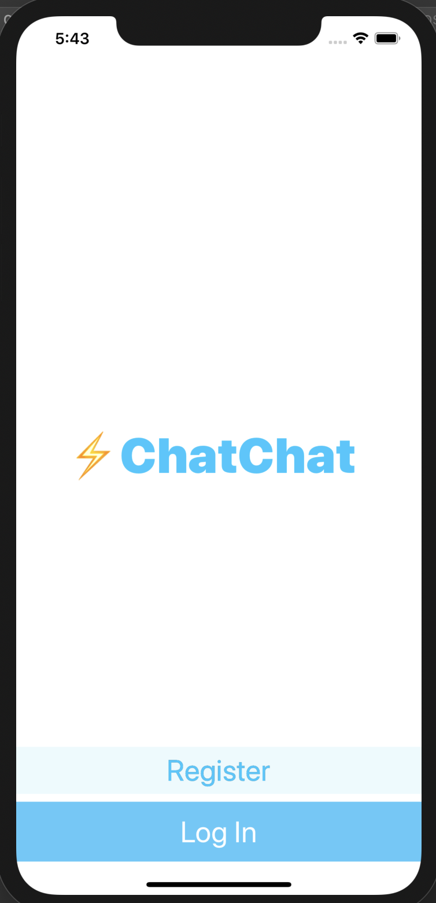

# Chat Chat App

## Utilities

Table Views, Firebase, Cocoapods, Swift Package Manager

## Functionality

Chat Chat is an internet based messaging app similar to WhatsApp, the popular messaging app that was bought by Facebook for $22 billion. The  app uses a service called Firebase Firestore as a backend database to store and retrieve our messages from the cloud. 

## To Run
Use ' pod install' in terminal to install dependencies.

Make sure Google service has proper authentications.
